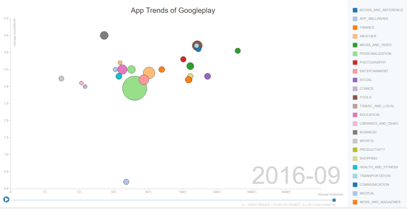

Title: App发展趋势分析
Date: 2016-10-13 14:30
Modified: 2016-10-13 14:30
lang: cn
Category: analysis
Tags: analysis, app
Slug: app_trends
Summary: App发展趋势分析

# 1.人类开发的app代码可以从地球直达月球了

Android于2007年11月5日问世以来，googleplay中app数量已超过200万个，结合我们数据库来推测，如果算上各种app的迭代版本，地球上的程序员们造出来的app数量应该已经超过了1500万个。按照每个app的大小平均30MB计算、平均每个app拥有超过10万行以上的代码，如果把这些代码成行排列，足可以从地球到达月球了。本次数据分析选取了150万的app数据，其中以googleplay的app占90%以上。

# 2.如何选择要分析的app的数据类型

App的属性有很多，appinner.com更是提供了多达20多个维度的数据类型可供分析。为了能反映出宏观的的趋势，我们选取了app的平均评分、平均下载量、类型、各类型的数量和发布时间5个维度来进行分析。其中平均评分是按同一类型的app的评分总量除以该类型app的总数量；平均下载量是按同一类型的app的下载总量除以该类型app的总数量。

我们以app的平均评分作为纵轴，每个类型的app代表一个点，点的直径代表该类型app的总数量，横轴为每个类型app的平均下载量。统计数据从2008年10月开始到2016年9月结束，这些数据随时间的变化通过图形的动态展示出来。见链接：
https://www.appinner.com/main/page/apptrend

# 3.从googleplay的趋势中能看到哪些机会？

最开始，2008年10月，googleplay商店里面只有tools、game、travel and local这几个类型，这些可能是大家一开始能想到的用智能手机能做的工作了。随后finance、social、entertainment等类别逐渐出现，而后随着时间的推移，app的类别越来越丰富。

2010年底，但类型app的平均下载量刚超过10万，2011年底则有多个类型app的平均下载量已突破500万。2012年低，app进一步分化，social、transport、shopping、media等类型下载量越来越大，竞争越发白热化，而sports、business和medical类型则还出于低位，此时app开发者的大好时机应该是这些类别的应用。
2013年底，media and video类型的app平均下载量已突破1000万，media and video、communication、social、transport、music、media类型的app在平均下载量上成为第一梯队；tools、shopping、productivity、news&magazine和photography成为第二梯队。新闻和美图快速成长（2012年8月今日头条发布第一个版本）。
2014年的数据显示，所有app的平均下载量都开始略微下降，而每个类型的app的数量开始迅速上升，反应在图上的趋势就是整体的数据点左移，各个点都在快速增大，其中以game类型尤为明显，客观上来说，从2014年开始，更多的人开发了更多的app，竞争压力增大了。

2015年，除了延续上一年的趋势外，有两个值得注意的点，就是education和health&fitness迅速右移，对应着教育和可穿戴类型的app的扩张。

2016年的数据显示，整体的数据点在继续增大的同时向右移动，说明移动app的渗透率已经快速上升，business类型的app数量成长明显，toB的趋势也开始显现出来。
此外，从app的平均评分来看，business和tools类型的app均在4分以上，用户满意度很高，而game和wallpaper类型则较低，其中壁纸类应用竟然低于0.5分。
如果你仔细研究这些的数据的动态演进，你一定能发现更多有趣的规律，通过以上分析，你找到新的机会了吗？
